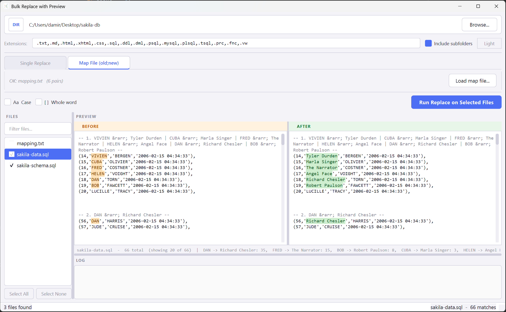

# Bulk Replace with Preview

A PyQt6 desktop tool for safe bulk text replacement in text-based files.
It supports both single replace and map-based replace (replacement pairs loaded from a map file), shows per-file before/after preview, and never modifies the original source folder.

All output is written to a sibling folder with the `_CLEAN` suffix.

<p align="center">
  
</p>

## What It Does

- Loads a folder from the file picker or via drag and drop
- Scans matching files by extension
- Lets you process a single `Find -> Replace with` pair or a map file in `old;new` format
- Shows side-by-side `BEFORE` and `AFTER` preview for the selected file
- Lets you include or exclude files with checkboxes before running
- Writes changed files into `<source_folder>_CLEAN`

## Current Features

### File Handling
- Folder picker plus drag and drop support
- Optional `Include subfolders`
- Extension filter field for controlling which files are scanned
- Automatic rescan when the folder settings change
- File search box for filtering the visible file list
- Double-click a file in `FILES` to open it in the default editor

### Replacement Modes
- `Single Replace` tab for one replace pair entered in the UI
- `Map File (old;new)` tab for multiple replacements from a `.txt` file
- Map file can also be dropped onto the window while the map tab is active
- If the map file is inside the source folder, it stays visible in `FILES` but is unchecked by default

### Matching Options
- `Case` option
- `Whole word` option
- Both options apply to single replace and map replace
- `Case` is off by default

### Preview
- Side-by-side `BEFORE` and `AFTER` preview panels
- Preview updates automatically for the selected file
- Preview groups nearby matches into one example instead of duplicating the same block unnecessarily
- Clicking inside `BEFORE` syncs to the same example in `AFTER`, and vice versa
- Highlighted matches are shown directly in the preview text

### Safety
- Original files are never changed
- Binary and unreadable files are skipped
- Output folder is recreated on each run so old stale results do not remain mixed in
- The map file itself is skipped during output generation
- Conflicting duplicate `old` keys in the map file are reported
- Duplicate `new` targets in map mode are blocked before execution

### UI
- Light and dark theme toggle
- Split file list / preview / log layout
- Custom application icon included in `assets/app_icon.ico`

## Default Supported Extensions

`.txt` `.md` `.html` `.xhtml` `.css`
`.sql` `.ddl` `.dml` `.psql` `.mysql` `.plsql` `.tsql` `.prc` `.fnc` `.vw`

You can change this list directly in the UI.

## Map File Format

One replacement per line:

```text
old_value;new_value
another_old;another_new
```

Rules:
- Empty lines are ignored
- Lines starting with `#` are ignored
- The first `;` splits `old` and `new`
- Spaces around values are trimmed

Example file:
- [docs/rename_map_file.txt](C:/Users/damir/PycharmProjects/BulkReplaceText/docs/rename_map_file.txt)

## Running

If your environment already has PyQt6 installed:

```bash
python main.py
```

## Assets

- [assets/app_icon.svg](C:/Users/damir/PycharmProjects/BulkReplaceText/assets/app_icon.svg)
- [assets/app_icon.ico](C:/Users/damir/PycharmProjects/BulkReplaceText/assets/app_icon.ico)
- [assets/app_icon.png](C:/Users/damir/PycharmProjects/BulkReplaceText/assets/app_icon.png)

The app loads the `.ico` automatically from `assets/app_icon.ico` and is prepared to resolve it both from source and from packaged builds.
