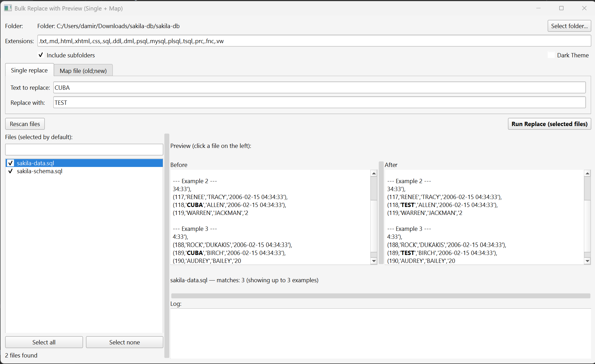

# Bulk Text Replace with Preview (Single + Map)

A GUI tool for **safe bulk text replacement** in text-based files  
(TXT, HTML/XHTML, CSS, SQL and related formats), with **per-file preview**,  
**file selection**, and support for **multiple replacement pairs loaded from a map file**.

The tool **never modifies original files**.  
All results are written to a separate output folder with the `_CLEAN` suffix.

  

---

# How it works:

* Open a folder (or drag & drop it onto the window)
* Choose whether to replace a single word or use a mapping file _**old name;new name**_  
  (spaces are permitted, each pair is a new row — example is in docs folder)
* Filter files using the search box, select which files to process
* Preview changes per file — matched text is **highlighted in color**
* Click replace
* Results are saved in a new folder, originals are preserved

---

## Key Features

### File Selection
- Select or **drag & drop** a folder containing files to process
- **Search / filter** the file list by typing in the search bar
- Automatically list matching files (all selected by default via checkboxes)
- Manually include/exclude individual files
- Optional recursive processing of subfolders
- **Double-click** any file in the list to open it in the default editor

### Replacement Modes
- Two modes via tabs:
  - **Single replace** – one `old → new` pair typed directly in the UI
  - **Map replace** – multiple replacements from a `.txt` file (`old;new` format)
- Drag & drop a map `.txt` file onto the window (while on Map tab) to load it instantly

### Preview
- Per-file **Before / After** side-by-side preview panels
- Preview **updates live** as you type the replacement text
- Matched text **highlighted in bold**
- Skips binary and unreadable files automatically

### UI / Appearance
- Modern **PyQt6** interface with resizable splitter panels
- **Dark / Light theme** switcher (checkbox in the top bar)
- Detailed execution log after completion

---

## Safety Guarantees

- Original files are **never modified**
- Output is written to: `<folder_name>_CLEAN/`
- The map file itself is skipped if it is located inside the processed folder
- Duplicate target values (`new`) in map mode are detected and execution is blocked

---

## Supported File Types (Default)
`.txt` `.md` `.html` `.xhtml` `.css`  
`.sql` `.ddl` `.dml` `.psql` `.mysql` `.plsql` `.tsql` `.prc` `.fnc` `.vw`
